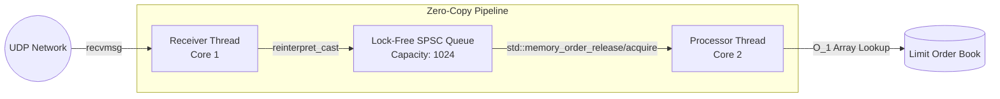
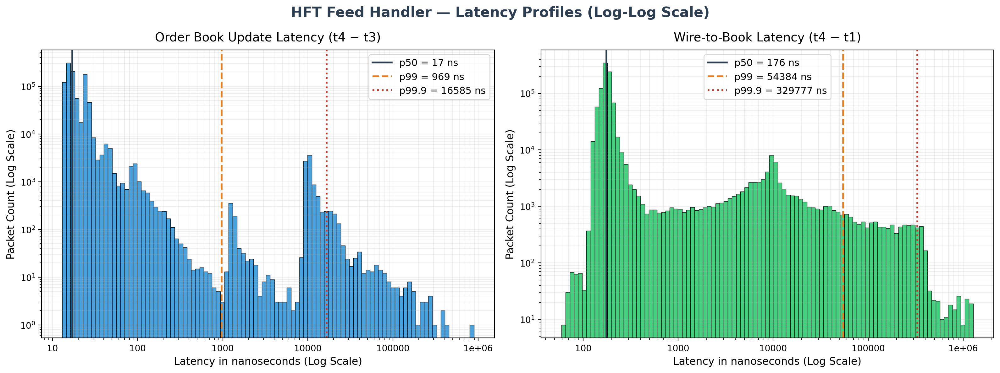

# Low-Latency Market Data Engine

A high-performance, zero-copy C++ pipeline designed to ingest, process, and apply market data to a Limit Order Book (LOB) with sub-microsecond latency. Designed with a modular architecture that could be adapted to kernel-bypass transports.

## Architecture

The system is built on a two-thread architecture utilizing a lock-free Single-Producer-Single-Consumer (SPSC) ring buffer to cross thread boundaries without Mutex contention.



## Performance Profile

Benchmarks executed on standard hardware using `CLOCK_MONOTONIC` software timestamps. Note: A production implementation would rely on NIC hardware timestamping (e.g., `SO_TIMESTAMPING`).

* **Order Book Application Latency:** The physical execution time to update the Bid/Ask array.
    * Compiled to 10 x86-64 machine instructions under GCC `-O3`.
* **Wire-to-Book Latency:** Measures the latency from packet receipt in the receiver thread to successful application in the order book.

### Benchmark Results

| Metric | p50 | p99 | p99.9 |
|----------|----------|----------|----------|
| Book Update | 17 ns | 969 ns | 16.5 us |
| Wire-to-Book | 176 ns | 54.3 us | 329 us |

### Latency Distribution



*Note: The observed tail latency is heavily dominated by OS scheduling and virtualization effects (WSL2 environment). These metrics represent a worst-case baseline. True p99/p99.9 evaluation requires deployment on a bare-metal Linux server with tuned kernel parameters (isolcpus, NO_HZ_FULL) and a kernel-bypass networking stack (e.g., Solarflare OpenOnload or DPDK).*

## Core Technical Concepts Demonstrated

1. **Zero-Copy Deserialization:** The `recvmsg` network buffer is cast directly to a packed `OrderMessage` struct via pointer arithmetic, eliminating dynamic memory allocation on the hot path.
2. **Lock-Free Concurrency:** The `SPSCQueue` utilizes C++11 `<atomic>` operations with explicit `std::memory_order_release` and `std::memory_order_acquire` fences.
3. **Cache-Line Optimization:** The ring buffer's `head` and `tail` indices are forcefully isolated using `alignas(std::hardware_destructive_interference_size)` to prevent false sharing.
4. **O(1) Data Structures:** The Limit Order Book uses a flat array indexed by price ticks, guaranteeing `O(1)` bounds checking and arithmetic addition/subtraction.
5. **Thread Affinity:** Threads are explicitly bound to separate physical CPU cores using `pthread_setaffinity_np`.

## Verification

- Unit tested with custom C++ test suites
- Address Sanitizer (ASAN)
- Undefined Behavior Sanitizer (UBSAN)
- GitHub Actions CI pipeline

## Build Instructions

**Prerequisites:** CMake 3.10+, GCC 10+ (or Clang equivalent), Linux/WSL.

```bash
mkdir build
cd build
cmake .. -DCMAKE_BUILD_TYPE=Release
make -j
```

## Execution

**Start the Feed Handler:**
```bash
./build/feed_handler
```

**Run the Market Simulator (in a separate terminal):**
```bash
python3 scripts/market_simulator.py
```
*Note: The Python simulator is designed for functional correctness and pipeline validation. Real-world throughput benchmarking would require a dedicated C++ pcap replay tool capable of saturating the network link.*
