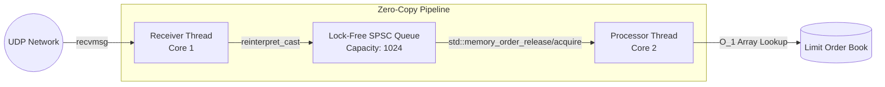

# Low-Latency UDP Feed Handler

A high-performance, zero-copy C++ pipeline designed to ingest, process, and apply market data to a Limit Order Book (LOB) with sub-microsecond latency.

## Architecture

The system is built on a two-thread, kernel-bypass-ready architecture utilizing a lock-free Single-Producer-Single-Consumer (SPSC) ring buffer to cross thread boundaries without Mutex contention.



## Performance Profile

Benchmarks executed on standard hardware using `CLOCK_MONOTONIC` hardware timestamps.

* **Order Book Application Latency:** The physical execution time to update the Bid/Ask array.
    * **Median (p50):** 17 nanoseconds (~68 CPU cycles)
    * Compiled to 10 x86-64 machine instructions using branchless `cmove`.
* **Wire-to-Book Latency:** The full pipeline transit from `recvmsg` unblocking, across the L1 cache via MESI hardware coherency, to final book application.
    * **Median (p50):** 176 nanoseconds

### Latency Distribution


*Note: The p99 tail latency (54µs) is a direct artifact of the Linux kernel OS scheduler waking the Receiver thread from sleep during bursty traffic conditions. In a true production environment, this is mitigated using kernel bypass (e.g., Solarflare OpenOnload/DPDK) and `isolcpus` thread spinning.*

## Core Technical Concepts Demonstrated

1. **Zero-Copy Deserialization:** The `recvmsg` network buffer is cast directly to a packed `OrderMessage` struct via pointer arithmetic, eliminating dynamic memory allocation on the hot path.
2. **Lock-Free Concurrency:** The `SPSCQueue` utilizes C++11 `<atomic>` operations with explicit `std::memory_order_release` and `std::memory_order_acquire` fences.
3. **Cache-Line Optimization:** The ring buffer's `head` and `tail` indices are forcefully isolated using `alignas(std::hardware_destructive_interference_size)` to prevent false sharing and MESI cache thrashing across CPU cores.
4. **O(1) Data Structures:** The Limit Order Book uses a flat array indexed by price ticks, guaranteeing `O(1)` bounds checking and arithmetic addition/subtraction.
5. **Thread Affinity:** Threads are explicitly bound to separate physical CPU cores using `pthread_setaffinity_np` to guarantee uninterrupted cache retention.

## Build Instructions

**Prerequisites:** CMake 3.10+, GCC 10+ (or Clang equivalent), Linux/WSL.

```bash
mkdir build
cd build
cmake .. -DCMAKE_BUILD_TYPE=Release
make -j
```

## Execution

**Start the Feed Handler:**
```bash
./build/feed_handler
```

**Run the Market Simulator (in a separate terminal):**
```bash
python3 scripts/market_simulator.py
```

The system will generate `latency_telemetry.csv` upon graceful shutdown (`SIGINT`).
